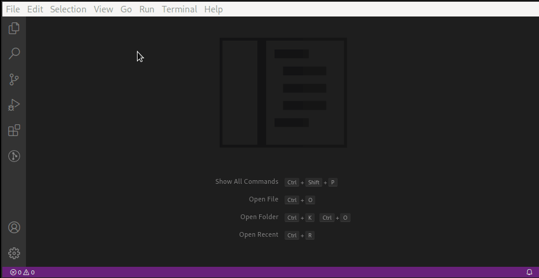
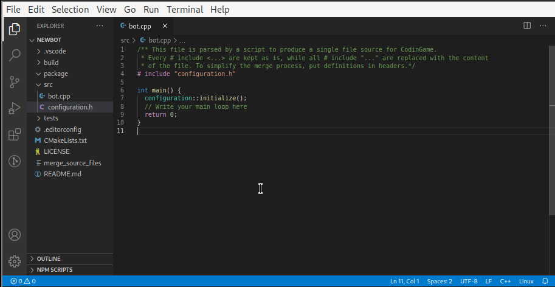

# CodinGame extension for VSCode

This extension gathers some tools I use to develop more easily bots for CodinGame. The priorities of this extension are to satisfy my current needs while being simple. As a result, the extension is not very flexible or customizable.

Keep in mind that this extension is the first I write. Also, I never programmed in TypeScript before. Thus, there might be silly things I do here that make you want to pull your hair.

> If you have any feature or improvement suggestions or want to participate in the development, let me know!
## 1. Features

### 1.1. Create a New C++ Bot Project

Create a new C++ bot project from a starter folder. The starter folder is expected to respect these rules:
- have a `CMakeLists.txt` at its root to build the project. This CMakeLists.txt must honor the following variables
  - REPOSITORY_ROOT, path of the root CodinGame folder, containing all bots and tools,
  - INCLUDE_DIR, path to the main C++ include folder where you can place common headers and external library headers,
  - LIB_DIR, path to the main C++ libraries folder where you can place external libraries.
- the build places the source code of the different bot version in a `package` folder. Remember that the CodinGame platform requires the bots to fit in a single file. The current bot version is in `package/bot.cpp`
- define `codinGame.gameId` and `codinGame.isMulti` settings.

I provide a working example of [starter C++ CodinGame project](https://github.com/tdelame/codingame_starter) in another repository.

### 1.2. Configure Project Build

Configure the build a bot, choosing its build type among Dev, Release, and Debug. Once the configuration is done, you can press `CTRL+SHIFT+B` to build the project, if you used [my starter C++ CodinGame project](https://github.com/tdelame/codingame_starter). You will also have symbol indexing, allowing you to navigate to symbols definitions or declarations, open headers, rename variables, find references, and so on.

### 1.3. Save Current Bot Version

Save the current version of the bot, i.e. the file `package/bot.cpp`, in a new file in the `package` folder. The new file is added the `CMakeLists.txt` in order to be compiled.

### 1.4. Get CodinGamer Id

Get your CodinGamer Id from the email and password associated to your CodinGame account. You may need this information for other tools.

### 1.5. Send Bot Code

Send a version of your bot code to CodinGame. Note that this feature is actually requesting the platform to play a match with your sent bot, in order to save the source code online. Thus, it can take 10s to 30s.

>TODO: Check if the bot was correctly compiled on the platform.

## 2. Requirements

You must have the EditorConfig for VS Code extension as well as the C/C++ extension activated.

This extension is meant to be used on Linux with the following tools installed:
* `cmake` to generate a build configuration for your projects
* `ninja` to build your projects
* `clang` to parse c++ files
* `compdb` to extend the `compile_commands.json` file generated by CMake with headers, such that they will be indexed by VSCode.

## 3. Extension Settings

This extension contributes the following settings:

* `codinGame.rootPath`: set it to the root directory of your CodinGame projects.
* `codinGame.includePath`: set it to the folder path containing common headers you use in your bots and tools. If not defined, it will be `codinGame.rootPath/tools/include`.
* `codinGame.libPath`: set it to the folder path containing common libraries you use in your tools. If not defined, it will be `codinGame.rootPath/tools/lib`.
* `codinGame.starterPath`: set it to the folder path containing an initial configuration for a bot. If not defined, it will be `codingGame.rootPath/tools/starter`
* `codinGame.gamerPassword`: set it to the password associated to your CodinGame account. I am not very proud of storing this information in settings, but I do not want to bother too much about this detail
* `codinGame.gamerEmail`: set it to the email address associated to your CodinGame account
* `codinGame.gameId`: set it in your project `.vscode/settings.json` file to the game Id of your bot
* `codinGame.isMulti`: set it to `true` in your project `.vscode/settings.json` file if your bot is for a multiplayer game.

## 4. Known Issues

## 5. Release Notes

## 1.0.0

### Added
- Command to create a bot project from a starter project
- Command to configure a bot build system
- Command to save current bot code as a named version
- Command to get CodinGamer Id from an account email + password
- Command to send a bot to CodinGame
- Global settings for `rootPath`, `includePath`, `libPath`, and `starterPath` that are used to create and configure a bot
- Global settings for `gamerPassword` and `gamerEmail` to connect to a CodinGame account
- Project settings for `gameId` and `isMulti` that are used to send a bot to CodinGame
